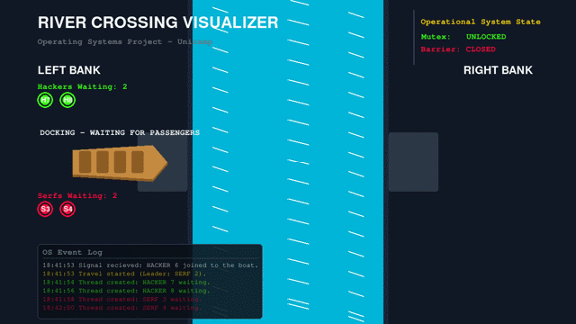

# Projeto de Animação Multithread - River Crossing

<p align="center">
  
  
  
  

> Projeto de implementação de concorrência e sincronização de threads utilizando Semáforos e Mutexes, inspirado no livro "The Little Book of Semaphores" (https://greenteapress.com/wp/semaphores/). Ele foi desenvolvido para a disciplina de Sistemas Operacionais da Unicamp (MC504), oferecida no 1s2026.

---

<p align="center">
  
</p>

## Índice
- [Sobre o Projeto](#-sobre-o-projeto)
- [O Problema: Travessia do Rio](#-o-problema-travessia-do-rio)
- [Solução de Sincronização](#-solução-de-sincronização)
- [Visualizador e Animação](#-visualizador-e-animação)
- [Compilação e Execução](#-como-compilar-e-executar)

---

## Sobre o Projeto
O objetivo deste projeto é demonstrar o uso prático de mecanismos de sincronização (semáforos e mutexes) aplicados a múltiplas threads, acompanhado de uma animação gráfica que exibe o estado global da aplicação em tempo real. A linguagem base para a lógica multithread é C utilizando a biblioteca `pthreads`, enquanto a animação foi feita em Python através do `pygame`.

## O Problema: Travessia do Rio (River Crossing)
Um barco a remo é compartilhado por hackers do sistema Linux e funcionários da Microsoft (carinhosamente referidos como "serfs" pelo autor de "The Little Book of Semaphores") para atravessar um rio. 

**Regras estritas da travessia:**
1. **Capacidade:** O barco suporta exatamente 4 pessoas e só viaja cheio.
2. **Combinações proibidas:** Não é permitido colocar 1 hacker com 3 serfs, nem 1 serf com 3 hackers.
3. **Opções de Embarque:** As únicas combinações permitidas são:
   - 4 Hackers
   - 4 Serfs
   - 2 Hackers e 2 Serfs.
4. **Embarque:** Toda thread que entra no barco deve invocar a função `board`. As 4 threads devem embarcar antes que a próxima viagem comece.
5. **Partida:** Após o barco estar cheio, exatamente um dos passageiros deve assumir os remos invocando a função `rowBoat`.

## Solução de Sincronização
Para evitar deadlocks e garantir acesso concorrente seguro, utilizamos as bibliotecas `pthread.h` e `semaphore.h` com os seguintes padrões:

* **Scoreboard (Placar):** Variáveis contadoras (`hackers` e `serfs`) protegidas por um mutex avaliam se um grupo seguro pode ser formado.
* **Filas de Espera:** Semáforos `hackerQueue` e `serfQueue` pausam as threads até que uma combinação válida esteja pronta.
* **Barreira (Barrier):** Uma estrutura de barreira exige que todos os 4 membros estejam a bordo antes que o "capitão" invoque o remo e libere o mutex para o embarque seguinte.

## Visualizador e Animação
A aplicação não se limita ao print de mensagens textuais no terminal. Um segundo processo, escrito em Python com a biblioteca Pygame, lê o estado do programa em C através de um pipe (`stdout` do C ligado ao `stdin` do Python) e o traduz em uma animação em tempo real.

* **Protocolo de comunicação:** Cada evento (`ARRIVED`, `BOARDED`, `ROWED`, `STATUS`, `Final`) é impresso pelo C no formato `ACAO:TIPO:ID` com `fflush(stdout)`, garantindo entrega imediata ao visualizador.
* **Thread de leitura:** Uma thread daemon lê o `stdin` e empilha os comandos em uma `queue.Queue` thread-safe, evitando que a leitura bloqueante trave o laço de renderização a 60 FPS.
* **Entidades e barco:** Hackers e serfs são representados por instâncias de `Entity`, exibidos aguardando em suas margens e embarcados durante a travessia, com movimento suavizado por interpolação; o barco alterna entre os estados esperando na doca, navegando e chegada, controlados por `boat_is_rowing`.
* **Estado e tela final:** Um painel lateral ilustra a formação dos grupos e o estado dos bloqueios de sincronização (mutex e barreira, mantidos em `sys_state`), junto ao log de eventos; ao final, um resumo exibe o total de hackers, serfs e viagens.

## Compilação e Execução

### Criando `venv` para instalar a biblioteca Pygame (Opcional)
Execute a partir da raiz do projeto (`multithread_animation/`):
```
python3 -m venv .

source bin/activate
```
### Instalando Pygame:
```
pip install pygame

sudo apt update && sudo apt install python3-pygame
```

### Como compilar o código do River Crossing
Execute a partir da raiz do projeto (`multithread_animation/`):
```
gcc -Wall -Wextra -pthread threads/main.c threads/river_crossing.c -o river_crossing

```


### Rodando o código do River Crossing e a Animação
```
./river_crossing | python3 animation/main.py
```
